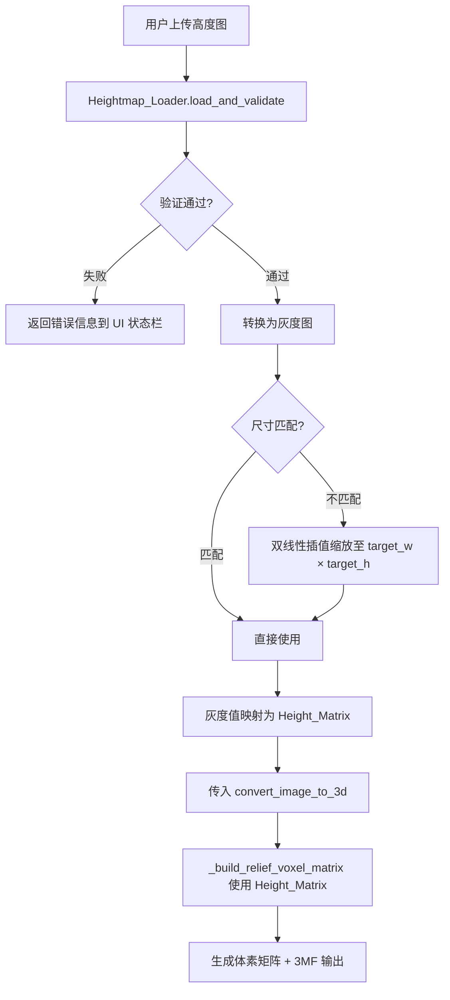
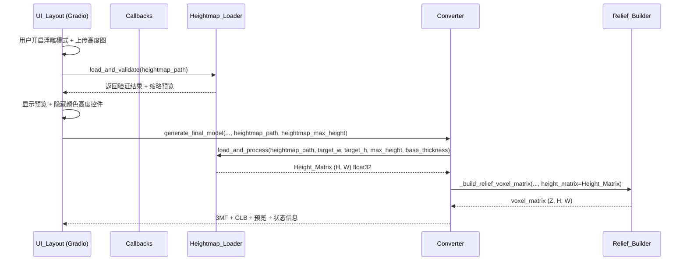

# 设计文档：高度图浮雕模式（Heightmap Relief Mode）

## 概述

本功能扩展现有 2.5D 浮雕模式，允许用户上传一张灰度图作为高度图（Heightmap），实现逐像素级别的 Z 轴高度控制。与现有按颜色统一分配高度的方式不同，高度图模式下每个像素的高度由对应灰度值独立决定，用户可在 Photoshop 等工具中精确绘制高度图。

核心设计决策：

- **新增 Heightmap_Loader 模块**：`core/heightmap_loader.py` 作为独立模块，负责高度图的加载、验证、缩放和灰度映射，保持 `converter.py` 的职责清晰
- **扩展 `_build_relief_voxel_matrix`**：新增 `height_matrix` 参数分支，当提供高度矩阵时使用逐像素高度，否则回退到现有的 `color_height_map` 逻辑
- **复用 `slider_conv_auto_height_max`**：高度图模式复用现有最大浮雕高度滑块，解决方案是将该滑块从 Accordion 内部提取为独立组件，在高度图模式下隐藏 Accordion 但保留滑块可见
- **灰度映射约定**：纯黑（0）= 最大高度，纯白（255）= 最小高度（底板厚度），符合 3D 建模领域的常见约定
- **向量化计算**：高度映射和体素矩阵构建使用 NumPy 向量化操作，避免逐像素 Python 循环，提升大图性能

## 架构

### 数据流



### 模块交互



### 关键设计决策：滑块提取

当前 `slider_conv_auto_height_max` 嵌套在自动高度生成器 Accordion 内部。高度图模式需要隐藏 Accordion 但仍访问该滑块值。

**解决方案**：将 `slider_conv_auto_height_max` 从 Accordion 内部提取到外部，作为独立组件。Accordion 仅包含模式选择和应用按钮。这样高度图模式隐藏 Accordion 时，滑块仍然可见可用。

```
浮雕模式开启时的 UI 布局：
├── ☑ 开启 2.5D 浮雕模式
├── 📁 高度图上传（新增，仅浮雕模式可见）
├── 🖼 高度图缩略预览（新增，上传后可见）
├── 🔢 最大浮雕高度滑块（从 Accordion 提取，始终可见）
├── 📊 逐色高度调节滑块（无高度图时可见，有高度图时隐藏）
└── ⚡ 自动高度生成器折叠面板（无高度图时可见，有高度图时隐藏）
```

## 组件与接口

### 1. Heightmap_Loader 模块 (`core/heightmap_loader.py`)

新增独立模块，负责高度图的完整处理流程。

```python
class HeightmapLoader:
    """高度图加载与处理器"""

    @staticmethod
    def load_and_validate(heightmap_path: str) -> dict:
        """
        加载并验证高度图文件。

        Args:
            heightmap_path: 高度图文件路径

        Returns:
            dict: {
                'success': bool,
                'grayscale': np.ndarray (H, W) uint8 或 None,
                'original_size': (w, h) 或 None,
                'thumbnail': np.ndarray 或 None,  # 用于 UI 预览
                'warnings': list[str],
                'error': str 或 None
            }
        """

    @staticmethod
    def load_and_process(
        heightmap_path: str,
        target_w: int,
        target_h: int,
        max_relief_height: float,
        base_thickness: float
    ) -> dict:
        """
        加载高度图并生成 Height_Matrix。完整处理流程：
        加载 → 验证 → 灰度转换 → 缩放 → 高度映射。

        Args:
            heightmap_path: 高度图文件路径
            target_w: 目标宽度（像素）
            target_h: 目标高度（像素）
            max_relief_height: 最大浮雕高度（mm）
            base_thickness: 底板厚度（mm）

        Returns:
            dict: {
                'success': bool,
                'height_matrix': np.ndarray (H, W) float32 单位 mm 或 None,
                'stats': {'min_mm': float, 'max_mm': float, 'avg_mm': float} 或 None,
                'warnings': list[str],
                'error': str 或 None
            }
        """

    @staticmethod
    def _to_grayscale(image: np.ndarray) -> np.ndarray:
        """将图像转换为单通道灰度图（彩色图取亮度通道）"""

    @staticmethod
    def _resize_to_target(
        grayscale: np.ndarray,
        target_w: int,
        target_h: int
    ) -> np.ndarray:
        """使用双线性插值缩放灰度图至目标尺寸"""

    @staticmethod
    def _map_grayscale_to_height(
        grayscale: np.ndarray,
        max_relief_height: float,
        base_thickness: float
    ) -> np.ndarray:
        """
        灰度值到高度的线性映射。
        公式: height_mm = max_relief_height - (grayscale / 255.0) * (max_relief_height - base_thickness)
        纯黑(0) → max_relief_height, 纯白(255) → base_thickness

        Returns:
            np.ndarray: (H, W) float32, 单位 mm
        """

    @staticmethod
    def _check_aspect_ratio(
        heightmap_w: int, heightmap_h: int,
        target_w: int, target_h: int
    ) -> str | None:
        """检查宽高比偏差，超过 20% 返回警告信息"""

    @staticmethod
    def _check_contrast(grayscale: np.ndarray) -> str | None:
        """检查灰度值标准差，小于 1.0 返回警告信息"""
```

### 2. Converter 扩展 (`core/converter.py`)

#### `convert_image_to_3d` 新增参数

```python
def convert_image_to_3d(
    ...,
    enable_relief=False,
    color_height_map=None,
    heightmap_path=None,          # 新增：高度图文件路径
    heightmap_max_height=None     # 新增：高度图最大高度（mm）
):
```

#### `_build_relief_voxel_matrix` 扩展

```python
def _build_relief_voxel_matrix(
    matched_rgb, material_matrix, mask_solid,
    color_height_map,             # 现有：按颜色分配高度
    default_height, structure_mode, backing_color_id, pixel_scale,
    height_matrix=None            # 新增：逐像素高度矩阵 (H, W) float32
):
    """
    当 height_matrix 不为 None 时，使用逐像素高度（高度图模式）。
    否则回退到现有的 color_height_map 逻辑。
    """
```

#### `generate_final_model` 扩展

```python
def generate_final_model(
    ...,
    enable_relief=False,
    color_height_map=None,
    heightmap_path=None,          # 新增
    heightmap_max_height=None     # 新增
):
```

### 3. UI 组件变更 (`ui/layout_new.py`)

#### 新增组件

| 组件                           | 类型       | 说明                                          |
| ------------------------------ | ---------- | --------------------------------------------- |
| `image_conv_heightmap`         | `gr.Image` | 高度图上传，type="filepath"，支持 PNG/JPG/BMP |
| `image_conv_heightmap_preview` | `gr.Image` | 高度图缩略预览，不可交互                      |

#### 布局调整

- `slider_conv_auto_height_max` 从 Accordion 内部移至外部，成为独立组件
- 高度图上传组件放置在浮雕模式复选框下方
- 高度图预览放置在上传组件旁边

#### 可见性控制逻辑

```python
def on_heightmap_upload(heightmap_path, enable_relief):
    """高度图上传回调"""
    if heightmap_path and enable_relief:
        # 验证高度图
        result = HeightmapLoader.load_and_validate(heightmap_path)
        if result['success']:
            # 隐藏颜色高度控件，显示高度图预览
            return (
                gr.update(visible=True, value=result['thumbnail']),  # 预览
                gr.update(visible=False),  # 逐色高度滑块
                gr.update(visible=False),  # 自动高度 Accordion
                warnings_to_status(result['warnings'])
            )
        else:
            return (gr.update(visible=False), ..., ..., result['error'])
    ...

def on_heightmap_clear(enable_relief):
    """高度图移除回调"""
    # 恢复显示颜色高度控件
    return (
        gr.update(visible=False),   # 隐藏预览
        gr.update(visible=True),    # 恢复逐色高度滑块
        gr.update(visible=True),    # 恢复自动高度 Accordion
        ""
    )
```

### 4. 参数传递链

```
UI 生成按钮点击
  → process_batch_generation(..., heightmap_path, heightmap_max_height)
    → generate_final_model(..., heightmap_path, heightmap_max_height)
      → convert_image_to_3d(..., heightmap_path, heightmap_max_height)
        → HeightmapLoader.load_and_process(heightmap_path, target_w, target_h, ...)
        → _build_relief_voxel_matrix(..., height_matrix=result['height_matrix'])
```

## 数据模型

### Height_Matrix

```python
# 类型: np.ndarray, dtype=float32, shape=(target_h, target_w)
# 单位: mm
# 值域: [base_thickness, max_relief_height]
# 语义: 每个元素表示对应像素位置的总高度（包含光学层 + 基座层）

height_matrix = np.array([
    [5.0, 4.5, 3.0, ...],  # 第 0 行
    [4.8, 4.2, 2.8, ...],  # 第 1 行
    ...
], dtype=np.float32)
```

### 灰度值到高度的映射公式

```
height_mm = max_relief_height - (grayscale / 255.0) * (max_relief_height - base_thickness)

其中:
  grayscale ∈ [0, 255]（uint8）
  max_relief_height = slider_conv_auto_height_max 的值（默认 5.0mm）
  base_thickness = slider_conv_thickness 的值（底板厚度）

映射关系:
  灰度 0   (纯黑) → max_relief_height（最高）
  灰度 128 (中灰) → (max_relief_height + base_thickness) / 2（中间）
  灰度 255 (纯白) → base_thickness（最低）
```

### 体素矩阵结构（高度图模式）

```
Z 轴（层）
  ↑
  │  ┌─────────────────────────┐
  │  │ 光学叠色层 (5层, 0.4mm) │ ← material_matrix[y,x,0:5]
  │  ├─────────────────────────┤
  │  │                         │
  │  │ 基座层 (backing_color)  │ ← 高度由 height_matrix[y,x] 决定
  │  │                         │
  │  └─────────────────────────┘
  └──────────────────────────────→ X/Y 轴

每个像素的总层数 = ceil(height_matrix[y,x] / LAYER_HEIGHT)
光学层固定 5 层，基座层 = 总层数 - 5
最小总层数 = OPTICAL_LAYERS (5)，即高度钳制为 0.4mm
```

### HeightmapLoader 返回值结构

```python
# load_and_validate 返回值
{
    'success': True,
    'grayscale': np.ndarray,       # (H, W) uint8
    'original_size': (640, 480),   # (w, h)
    'thumbnail': np.ndarray,       # 缩放后的预览图
    'warnings': [                  # 可能为空
        "⚠️ 高度图宽高比与原图偏差 25%，可能不匹配"
    ],
    'error': None
}

# load_and_process 返回值
{
    'success': True,
    'height_matrix': np.ndarray,   # (target_h, target_w) float32, 单位 mm
    'stats': {
        'min_mm': 1.2,
        'max_mm': 5.0,
        'avg_mm': 3.1
    },
    'warnings': [],
    'error': None
}
```

### Converter 参数扩展

```python
# convert_image_to_3d 新增参数
heightmap_path: Optional[str] = None      # 高度图文件路径
heightmap_max_height: Optional[float] = None  # 最大浮雕高度 (mm)

# 优先级逻辑:
# 1. heightmap_path 不为 None 且 enable_relief=True → 高度图模式
# 2. enable_relief=True 且 color_height_map 非空 → 现有颜色高度模式
# 3. 其他 → 标准平面模式
```

## 正确性属性（Correctness Properties）

_属性（Property）是指在系统所有合法执行中都应保持为真的特征或行为——本质上是对系统应做什么的形式化陈述。属性是人类可读规格说明与机器可验证正确性保证之间的桥梁。_

### Property 1: 灰度映射公式正确性

_对于任意_ 灰度值 g ∈ [0, 255]、任意 max_relief_height ∈ [2.0, 15.0] 且 max_relief_height > base_thickness、任意 base_thickness > 0，`_map_grayscale_to_height` 的输出应满足：

- `height_mm = max_relief_height - (g / 255.0) * (max_relief_height - base_thickness)`
- 输出值域 ∈ [base_thickness, max_relief_height]
- g=0 时 height_mm = max_relief_height
- g=255 时 height_mm = base_thickness

**Validates: Requirements 3.1, 3.2**

### Property 2: 高度图处理输出形状与类型不变量

_对于任意_ 有效图像文件（PNG/JPG/BMP，可为彩色或灰度）和任意目标尺寸 (target_w, target_h)，`load_and_process` 返回的 `height_matrix` 应满足：

- 形状为 (target_h, target_w)
- 数据类型为 float32
- 所有值 ∈ [base_thickness, max_relief_height]

**Validates: Requirements 1.2, 2.1, 2.3, 3.4**

### Property 3: 体素矩阵结构不变量

_对于任意_ Height_Matrix 和对应的 material_matrix、mask_solid，`_build_relief_voxel_matrix` 在高度图模式下生成的体素矩阵应满足：

- 对于每个实心像素 (y, x)，总层数 = max(OPTICAL_LAYERS, ceil(height_matrix[y,x] / LAYER_HEIGHT))
- 顶部 5 层（光学层）的材料 ID 来自 material_matrix[y, x, :]
- 光学层下方所有层的材料 ID = backing_color_id
- 体素矩阵 Z 维度 = ceil(max(height_matrix[mask_solid]) / LAYER_HEIGHT)
- 非实心像素的所有层 = -1（空气）

**Validates: Requirements 4.1, 4.2, 4.3, 4.4**

### Property 4: 模式优先级正确性

_对于任意_ 参数组合，当 `heightmap_path` 不为 None 且 `enable_relief=True` 时，Converter 应使用高度图模式（调用 HeightmapLoader），忽略 `color_height_map`；当 `heightmap_path` 为 None 且 `enable_relief=True` 时，应回退到 `color_height_map` 模式。

**Validates: Requirements 1.4, 6.3**

### Property 5: 验证警告条件

_对于任意_ 两组尺寸 (w1, h1) 和 (w2, h2)，当宽高比偏差 `|w1/h1 - w2/h2| / (w2/h2) > 0.2` 时，`_check_aspect_ratio` 应返回非 None 的警告字符串；_对于任意_ 灰度图，当灰度值标准差 < 1.0 时，`_check_contrast` 应返回非 None 的警告字符串。

**Validates: Requirements 8.2, 8.3**

### Property 6: 无效文件错误处理

_对于任意_ 非图像文件（随机字节序列），`load_and_validate` 应返回 `success=False` 且 `error` 字段包含描述性错误信息。

**Validates: Requirements 8.1**

## 错误处理

### 错误分类与处理策略

| 错误场景                      | 处理方式                               | 用户反馈                                               |
| ----------------------------- | -------------------------------------- | ------------------------------------------------------ |
| 高度图文件无法读取            | `load_and_validate` 返回 error         | 状态栏显示 "❌ 无法读取高度图文件: {原因}"             |
| 高度图宽高比偏差 > 20%        | 继续处理，附加 warning                 | 状态栏显示 "⚠️ 高度图宽高比与原图偏差较大，可能不匹配" |
| 高度图缺乏对比度（std < 1.0） | 继续处理，附加 warning                 | 状态栏显示 "⚠️ 高度图灰度变化极小，浮雕效果可能不明显" |
| 高度值 < OPTICAL_LAYERS 厚度  | 钳制为最小值                           | 无额外提示（静默处理）                                 |
| HeightmapLoader 内部异常      | 捕获异常，回退到 color_height_map 模式 | 状态栏显示 "⚠️ 高度图处理失败，已回退到颜色高度模式"   |
| heightmap_path 为 None        | 正常回退到现有逻辑                     | 无额外提示                                             |

### 异常处理链

```python
# convert_image_to_3d 中的异常处理
try:
    if heightmap_path and enable_relief:
        result = HeightmapLoader.load_and_process(
            heightmap_path, target_w, target_h,
            heightmap_max_height, spacer_thick
        )
        if result['success']:
            height_matrix = result['height_matrix']
            # 使用高度图模式
        else:
            # 高度图处理失败，回退
            warnings.append(result['error'])
            height_matrix = None
except Exception as e:
    print(f"[CONVERTER] Heightmap processing error: {e}")
    height_matrix = None  # 回退到 color_height_map 模式
```

## 测试策略

### 属性测试（Property-Based Testing）

使用 **Hypothesis** 库进行属性测试，每个属性至少运行 100 次迭代。

| 属性                       | 测试文件                             | 生成器策略                                                                              |
| -------------------------- | ------------------------------------ | --------------------------------------------------------------------------------------- |
| Property 1: 灰度映射公式   | `tests/test_heightmap_properties.py` | `st.integers(0, 255)`, `st.floats(2.0, 15.0)`, `st.floats(0.1, 2.0)`                    |
| Property 2: 输出形状不变量 | `tests/test_heightmap_properties.py` | 随机生成 (H, W, C) 图像数组 + 随机目标尺寸                                              |
| Property 3: 体素矩阵结构   | `tests/test_heightmap_properties.py` | 随机 Height_Matrix + 随机 material_matrix + 随机 mask_solid                             |
| Property 4: 模式优先级     | `tests/test_heightmap_properties.py` | 随机组合 heightmap_path (None/有效路径) + enable_relief (True/False) + color_height_map |
| Property 5: 验证警告条件   | `tests/test_heightmap_properties.py` | 随机尺寸对 + 随机灰度图                                                                 |
| Property 6: 无效文件处理   | `tests/test_heightmap_properties.py` | `st.binary()` 生成随机字节                                                              |

每个测试必须包含注释标签：

```python
# Feature: heightmap-relief-mode, Property 1: 灰度映射公式正确性
```

### 单元测试

| 测试场景                        | 测试文件                       | 说明                              |
| ------------------------------- | ------------------------------ | --------------------------------- |
| 纯黑图映射为最大高度            | `tests/test_heightmap_unit.py` | 边界条件 (3.1)                    |
| 纯白图映射为底板厚度            | `tests/test_heightmap_unit.py` | 边界条件 (3.1)                    |
| 高度钳制为最小光学层厚度        | `tests/test_heightmap_unit.py` | 边界条件 (4.5)                    |
| 彩色图正确转灰度                | `tests/test_heightmap_unit.py` | 示例 (1.2)                        |
| 尺寸不匹配时正确缩放            | `tests/test_heightmap_unit.py` | 示例 (2.1)                        |
| UI 可见性切换                   | `tests/test_heightmap_ui.py`   | Playwright 端到端 (5.1, 5.2, 5.4) |
| 高度图上传后预览显示            | `tests/test_heightmap_ui.py`   | Playwright 端到端 (1.3)           |
| 参数传递到 generate_final_model | `tests/test_heightmap_unit.py` | 集成测试 (6.4)                    |
| 预览状态栏显示统计信息          | `tests/test_heightmap_unit.py` | 示例 (7.1)                        |

### 测试配置

```python
# conftest.py 或测试文件头部
from hypothesis import settings

# 属性测试至少 100 次迭代
@settings(max_examples=100)
```

### 双重测试策略说明

- **属性测试**：验证对所有输入都成立的通用规则（如映射公式、形状不变量、结构不变量）
- **单元测试**：验证特定边界条件、具体示例和 UI 交互
- 两者互补：属性测试覆盖输入空间，单元测试锚定关键场景
