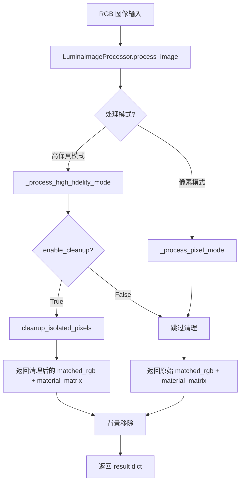
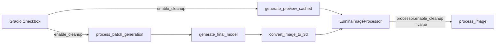

# 设计文档：孤立像素清理（Isolated Pixel Cleanup）

## 概述

本功能在 Lumina Studio 的 3MF 生成流程中，于 LUT 颜色匹配之后、背景移除之前，对 `material_matrix` 执行孤立像素检测与替换。孤立像素是指其 5 层材料堆叠编码与所有 8 邻域像素均不同的像素点，这些像素在打印时会产生不必要的换色操作。

核心思路：将每个像素的 5 层材料 ID 编码为单个整数（堆叠编码），通过 NumPy 向量化操作快速检测孤立像素，然后用邻域众数替换，同时同步更新 `matched_rgb` 以保持数据一致性。

设计决策要点：

- **独立模块**：`core/isolated_pixel_cleanup.py` 作为纯函数模块，不依赖 `LuminaImageProcessor` 内部状态
- **实例属性控制**：通过 `LuminaImageProcessor` 的实例属性 `enable_cleanup` 控制是否执行清理，避免修改 `process_image` 签名
- **单轮清理**：仅执行一次 pass，避免过度平滑导致细节丢失
- **像素模式豁免**：像素模式下自动跳过清理，保护像素艺术的精确性

## 架构

### 数据流



### 集成位置

清理步骤插入在 `process_image` 方法中，精确位置为：

1. `_process_high_fidelity_mode` 返回 `matched_rgb, material_matrix, bg_reference, debug_data` 之后
2. 背景移除逻辑（`mask_transparent` 计算）之前

```python
# 现有代码：高保真模式处理
matched_rgb, material_matrix, bg_reference, debug_data = self._process_high_fidelity_mode(...)

# >>> 新增：孤立像素清理（可选后处理）<<<
if modeling_mode == ModelingMode.HIGH_FIDELITY and self.enable_cleanup:
    try:
        from core.isolated_pixel_cleanup import cleanup_isolated_pixels
        matched_rgb, material_matrix = cleanup_isolated_pixels(
            material_matrix, matched_rgb, self.lut_rgb, self.ref_stacks
        )
    except ImportError:
        print("[IMAGE_PROCESSOR] ⚠️ isolated_pixel_cleanup module not found, skipping")

# 现有代码：背景移除
mask_transparent = mask_transparent_initial.copy()
```

### UI 集成



Checkbox 的值通过 Gradio inputs 列表传递到 `generate_preview_cached` 和 `process_batch_generation`，在创建 `LuminaImageProcessor` 实例后设置 `processor.enable_cleanup` 属性。

## 组件与接口

### 1. 核心模块：`core/isolated_pixel_cleanup.py`

独立纯函数模块，包含所有检测和替换逻辑。

```python
def cleanup_isolated_pixels(
    material_matrix: np.ndarray,  # (H, W, 5) 材料堆叠矩阵
    matched_rgb: np.ndarray,      # (H, W, 3) 匹配的 RGB 颜色
    lut_rgb: np.ndarray,          # (N, 3) LUT 颜色表
    ref_stacks: np.ndarray        # (N, 5) LUT 材料堆叠表
) -> tuple[np.ndarray, np.ndarray]:
    """
    检测并替换孤立像素。

    返回:
        (cleaned_matched_rgb, cleaned_material_matrix) - 清理后的副本，不修改输入数组
    """
```

内部辅助函数：

```python
def _encode_stacks(material_matrix: np.ndarray, base: int) -> np.ndarray:
    """
    将 (H, W, 5) 的材料矩阵编码为 (H, W) 的整数矩阵。
    编码公式: layer0 * B^4 + layer1 * B^3 + layer2 * B^2 + layer3 * B + layer4
    其中 B = max(material_id) + 1
    """

def _detect_isolated(encoded: np.ndarray) -> np.ndarray:
    """
    检测孤立像素，返回 (H, W) 布尔掩码。
    孤立像素 = 堆叠编码与所有 8 邻域均不同。
    边界像素仅使用实际存在的邻居。
    """

def _find_neighbor_mode(encoded: np.ndarray, isolated_mask: np.ndarray) -> np.ndarray:
    """
    对每个孤立像素，找到其 8 邻域中出现次数最多的堆叠编码。
    返回 (H, W) 数组，非孤立像素位置值无意义。
    """
```

### 2. 集成点：`LuminaImageProcessor` 类修改

仅修改两处，不改变任何函数签名：

**`__init__` 方法**：添加实例属性

```python
def __init__(self, lut_path, color_mode):
    # ... 现有代码 ...
    self.enable_cleanup = True  # 默认开启孤立像素清理
```

**`process_image` 方法**：在高保真模式处理后添加可选后处理调用（约 6 行代码）

### 3. UI 组件：Gradio Checkbox

在 `ui/layout_new.py` 的 `create_converter_tab_content` 函数中，Advanced Accordion 内 tolerance slider 之后添加：

```python
components['checkbox_conv_cleanup'] = gr.Checkbox(
    label="孤立像素清理 | Isolated Pixel Cleanup",
    value=True,
    info="清理 LUT 匹配后的孤立像素，减少换色操作"
)
```

### 4. 调用链修改

以下函数需要在参数列表中添加 `enable_cleanup` 参数，并在创建 `LuminaImageProcessor` 后设置属性：

| 函数                               | 文件                | 修改内容                                                    |
| ---------------------------------- | ------------------- | ----------------------------------------------------------- |
| `generate_preview_cached_with_fit` | `ui/layout_new.py`  | 添加 `enable_cleanup` 参数                                  |
| `generate_preview_cached`          | `core/converter.py` | 添加 `enable_cleanup` 参数，设置 `processor.enable_cleanup` |
| `process_batch_generation`         | `ui/layout_new.py`  | 添加 `enable_cleanup` 参数                                  |
| `generate_final_model`             | `core/converter.py` | 添加 `enable_cleanup` 参数                                  |
| `convert_image_to_3d`              | `core/converter.py` | 添加 `enable_cleanup` 参数，设置 `processor.enable_cleanup` |

注意：`process_image` 的签名不变，`enable_cleanup` 通过实例属性传递。

### 5. Gradio Inputs 列表修改

预览按钮和生成按钮的 inputs 列表末尾追加 `components['checkbox_conv_cleanup']`。

## 数据模型

### 核心数据结构

#### 1. Material Matrix

- 类型：`np.ndarray`，形状 `(H, W, 5)`，dtype `int`
- 每个像素包含 5 层材料 ID
- 材料 ID 范围取决于颜色模式：2色(0-1)、4色(0-3)、6色(0-5)、8色(0-7)

#### 2. Matched RGB

- 类型：`np.ndarray`，形状 `(H, W, 3)`，dtype `uint8`
- LUT 匹配后每个像素的 RGB 颜色值

#### 3. 堆叠编码（Encoded Stacks）

- 类型：`np.ndarray`，形状 `(H, W)`，dtype `int64`
- 编码公式：`layer0 * B^4 + layer1 * B^3 + layer2 * B^2 + layer3 * B + layer4`
- B（基数）= `max(material_id) + 1`，由 `material_matrix` 的最大值推导
- 各模式下的 B 值和最大编码值：

| 颜色模式 | B 值 | 最大编码值 | dtype 安全性 |
| -------- | ---- | ---------- | ------------ |
| 2色      | 2    | 31         | int32 足够   |
| 4色      | 4    | 1023       | int32 足够   |
| 6色      | 6    | 7775       | int32 足够   |
| 8色      | 8    | 32767      | int32 足够   |

#### 4. 孤立像素掩码（Isolated Mask）

- 类型：`np.ndarray`，形状 `(H, W)`，dtype `bool`
- `True` 表示该像素为孤立像素

#### 5. 邻域众数映射（Neighbor Mode Map）

- 类型：`np.ndarray`，形状 `(H, W)`，dtype `int64`
- 每个孤立像素位置存储其 8 邻域中出现次数最多的堆叠编码

#### 6. LUT 数据

- `lut_rgb`：`np.ndarray`，形状 `(N, 3)`，所有 LUT 颜色的 RGB 值
- `ref_stacks`：`np.ndarray`，形状 `(N, 5)`，每个 LUT 颜色对应的 5 层材料堆叠
- N 取决于颜色模式：32 / 1024 / 1296 / 2738

#### 7. 清理统计信息

- `total_pixels`：总像素数（H × W）
- `isolated_count`：检测到的孤立像素数
- `replaced_count`：实际替换的像素数
- `percentage`：替换像素占总像素的百分比

### 堆叠编码算法

向量化实现，避免逐像素循环：

```python
# B = material_matrix 中的最大值 + 1
base = int(material_matrix.max()) + 1
# 权重向量: [B^4, B^3, B^2, B^1, B^0]
weights = np.array([base**i for i in range(4, -1, -1)], dtype=np.int64)
# 向量化编码: (H, W, 5) @ (5,) -> (H, W)
encoded = np.sum(material_matrix.astype(np.int64) * weights, axis=2)
```

### 孤立像素检测算法

使用 8 方向平移比较，向量化实现：

```python
# 8 个方向的偏移: (dy, dx)
directions = [(-1,-1), (-1,0), (-1,1), (0,-1), (0,1), (1,-1), (1,0), (1,1)]

# 对每个方向，比较中心像素与邻居是否相同
# 使用 np.roll 或切片操作实现平移
# 边界处理：使用切片而非 np.roll（避免环绕）
# 统计每个像素与邻居不同的次数
# 孤立 = 与所有实际邻居都不同
```

### 邻域众数算法

对每个孤立像素，统计 8 邻域中各堆叠编码的出现次数：

```python
# 方案：对孤立像素逐个处理（数量通常很少）
# 或使用 scipy.ndimage.generic_filter（如果可用）
# 优先使用 NumPy 原生操作，避免额外依赖
```

## 正确性属性（Correctness Properties）

_属性（Property）是指在系统所有合法执行中都应成立的特征或行为——本质上是对系统应做什么的形式化陈述。属性是人类可读规格说明与机器可验证正确性保证之间的桥梁。_

### Property 1: 堆叠编码唯一性

_For any_ 两个不同的 5 层材料堆叠组合（在给定基数 B 下），它们的堆叠编码必须不同。即编码函数是单射的：如果 `encode(stack_a) == encode(stack_b)`，则 `stack_a == stack_b`。

**Validates: Requirements 1.1**

### Property 2: 孤立像素检测正确性

_For any_ 编码矩阵和其中的非边界像素，该像素被判定为孤立当且仅当其编码值与所有 8 个邻居的编码值均不相同。对于边界像素，仅与实际存在的邻居（3 个或 5 个）比较。

**Validates: Requirements 1.2, 1.3**

### Property 3: 邻域众数替换正确性

_For any_ 被判定为孤立的像素，其替换后的堆叠编码必须等于该像素 8 邻域中出现次数最多的堆叠编码。当存在多个并列众数时，替换值必须是其中之一。

**Validates: Requirements 2.1, 2.2, 5.1**

### Property 4: LUT 一致性

_For any_ 经过清理的像素，其替换后的 `material_matrix` 5 层值和 `matched_rgb` RGB 值必须严格对应同一个 LUT 条目。即在 `ref_stacks` 中查找该 material_matrix 值，对应的 `lut_rgb` 行必须等于该像素的 `matched_rgb` 值。

**Validates: Requirements 2.3, 5.2, 8.2, 8.4**

### Property 5: 非孤立像素不变性

_For any_ 输入的 `material_matrix` 和 `matched_rgb`，清理后所有未被判定为孤立的像素，其 `material_matrix` 和 `matched_rgb` 值必须与清理前完全相同。

**Validates: Requirements 4.3, 8.1**

### Property 6: 清理单调性

_For any_ 输入的 `material_matrix`，对清理后的结果再次执行孤立像素检测，检测到的孤立像素数量必须小于或等于清理前的数量。

**Validates: Requirements 5.3**

### Property 7: 关闭状态等价性

_For any_ 输入，当 `enable_cleanup` 为 `False` 时，`cleanup_isolated_pixels` 不被调用，输出的 `material_matrix` 和 `matched_rgb` 必须与原始 LUT 匹配结果完全相同。

**Validates: Requirements 6.3**

### Property 8: 纯函数不修改输入

_For any_ 输入的 `material_matrix` 和 `matched_rgb` 数组，调用 `cleanup_isolated_pixels` 后，原始输入数组的内容必须与调用前完全相同（函数返回副本，不就地修改）。

**Validates: Requirements 7.2**

### Property 9: 统计信息正确性

_For any_ 输入，`cleanup_isolated_pixels` 返回的统计信息中，`isolated_count` 必须等于检测到的孤立像素布尔掩码中 `True` 的数量，`percentage` 必须等于 `replaced_count / total_pixels * 100`。

**Validates: Requirements 8.3**

## 错误处理

### 1. 模块导入失败

当 `core/isolated_pixel_cleanup.py` 不存在或导入失败时：

```python
try:
    from core.isolated_pixel_cleanup import cleanup_isolated_pixels
    matched_rgb, material_matrix = cleanup_isolated_pixels(...)
except ImportError:
    print("[IMAGE_PROCESSOR] ⚠️ isolated_pixel_cleanup module not found, skipping")
```

行为：静默跳过清理，返回原始结果，不影响正常流程。

### 2. 空图像或极小图像

当 `material_matrix` 的 H 或 W 小于 3 时，所有像素都是边界像素，可能没有完整的 8 邻域。处理策略：正常执行检测，边界像素使用实际存在的邻居判定。如果图像为 1×1，则没有邻居，该像素不会被判定为孤立（没有邻居可比较）。

### 3. 全同色图像

当所有像素的堆叠编码相同时，没有孤立像素，函数直接返回输入的副本，统计信息中 `isolated_count = 0`。

### 4. 全不同色图像

极端情况下每个像素都是孤立的。函数正常执行众数替换，但结果可能仍有孤立像素（这是预期行为，因为只执行单轮清理）。

### 5. 数据类型安全

`material_matrix` 的值在编码时转换为 `int64`，避免溢出。8色模式下最大编码值为 32767，`int32` 即可安全表示，但使用 `int64` 提供额外安全边际。

## 测试策略

### 属性测试（Property-Based Testing）

使用 **Hypothesis** 库进行属性测试，每个属性测试至少运行 100 次迭代。

测试文件：`tests/test_isolated_pixel_cleanup_properties.py`

每个测试用 `@given` 装饰器生成随机输入，并用注释标注对应的设计属性：

```python
# Feature: isolated-pixel-cleanup, Property 1: 堆叠编码唯一性
@given(stack_a=st.lists(st.integers(0, 7), min_size=5, max_size=5),
       stack_b=st.lists(st.integers(0, 7), min_size=5, max_size=5))
@settings(max_examples=100)
def test_encoding_uniqueness(stack_a, stack_b):
    ...
```

属性测试覆盖：

| 属性       | 测试描述     | 生成器策略                                                       |
| ---------- | ------------ | ---------------------------------------------------------------- |
| Property 1 | 编码唯一性   | 随机生成两个 5 层堆叠，验证编码相同当且仅当堆叠相同              |
| Property 2 | 检测正确性   | 随机生成小尺寸编码矩阵（3-20），验证孤立判定符合定义             |
| Property 3 | 众数替换     | 随机生成含孤立像素的矩阵，验证替换值是邻域众数                   |
| Property 4 | LUT 一致性   | 随机生成 material_matrix 和对应 LUT，验证清理后 RGB-堆叠对应关系 |
| Property 5 | 非孤立不变性 | 随机生成矩阵，验证非孤立像素清理前后不变                         |
| Property 6 | 清理单调性   | 随机生成矩阵，验证二次检测孤立数 ≤ 首次                          |
| Property 7 | 关闭等价性   | 随机生成矩阵，验证 enable_cleanup=False 时输出等于输入           |
| Property 8 | 纯函数性     | 随机生成矩阵，验证调用后输入数组不变                             |
| Property 9 | 统计正确性   | 随机生成矩阵，验证统计数值与实际检测结果一致                     |

### 单元测试

测试文件：`tests/test_isolated_pixel_cleanup.py`

单元测试聚焦于具体示例和边界情况：

- **编码计算**：手工构造已知堆叠，验证编码值
- **3×3 矩阵孤立检测**：中心像素与所有邻居不同 → 孤立
- **3×3 矩阵非孤立**：中心像素与至少一个邻居相同 → 非孤立
- **边界像素处理**：角落像素（3 邻居）和边缘像素（5 邻居）的正确判定
- **1×1 图像**：无邻居，不判定为孤立
- **全同色图像**：无孤立像素
- **ImportError 降级**：模拟模块不存在，验证跳过清理
- **像素模式跳过**：验证像素模式下不执行清理
- **高保真模式执行**：验证高保真模式下执行清理

### 测试配置

```python
# conftest.py 或测试文件头部
from hypothesis import settings, HealthCheck

settings.register_profile("ci", max_examples=200)
settings.register_profile("dev", max_examples=100)
settings.load_profile("dev")
```
