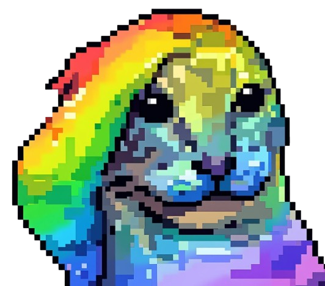

<p align="center">
  
</p>

<h1 align="center">Lumina Studio</h1>

<p align="center">
  基于物理校准的多材料FDM色彩系统
</p>

<p align="center">
  <a href="https://github.com/MOVIBALE/Lumina-Layers/stargazers">
    
  </a>
  &nbsp;
  <a href="https://github.com/MOVIBALE/Lumina-Layers/releases/latest">
    
  </a>
  &nbsp;
  <a href="LICENSE">
    
  </a>
</p>

<p align="center">
  <a href="README.md">📖 English Version / 英文文档</a>
</p>

---

<h2 align="center">官方链接与社区</h2>

<p align="center"><b>GitHub 仓库：</b></p>
<p align="center">
  <a href="https://github.com/MOVIBALE/Lumina-Layers">
    
  </a>
</p>

<p align="center"><b>加入 Discord 社区：</b></p>
<p align="center">
  <a href="https://discord.gg/57whRe3C8G">
    
  </a>
</p>

<p align="center"><b>订阅 YouTube 频道：</b></p>
<p align="center">
  <a href="https://www.youtube.com/channel/UCyP2Euw9whk1j-MT8d652Kw">
    
  </a>
</p>

<p align="center"><b>在 Patreon 支持我们：</b></p>
<p align="center">
  <a href="https://www.patreon.com/Lumina_studio">
    
  </a>
</p>

<p align="center"><b>关注我们的 Bilibili：</b></p>
<p align="center">
  <a href="https://b23.tv/CCxxiKC">
    
  </a>
</p>

<p align="center"><b>加入 QQ 交流群：</b></p>
<p align="center">
  <a href="https://qm.qq.com/q/vocxOMTnj2">
    
  </a>
</p>

---

## 项目状态

**当前版本**: v1.6.7  
**协议**: GNU GPL v3.0  
**性质**: 非营利性开源社区项目

---
## 项目背景
Lumina为了简化用户使用hueforge/flatforge等其他软件学习门槛过高或需要使用指定要求的耗材的问题，基于物理校准使用了穷举法和简化穷举法来获得实际打印颜色，目前的模式并未带来任何颜色理论计算（未来可能会在2.0的高级功能中推出基于颜色/td值等的颜色计算玩法），目前采取的方法是打印-拍摄-提取颜色-根据提取的颜色映射堆叠配方-打印（这像是一种颜色匹配功能，就像是你在autoforge和CMYK Lithophane那样会默认给你匹配一些颜色的功能一样，所以受此启发）

## 功能
**颜色模式 Color Modes**

2/4/5/6/8色

**生成模式 Generation Modes**

高保真模式/像素模式/svg模式

High-fidelity mode / Pixel mode / SVG mode

**其他功能 Other Features**

自定义色卡和校准颜色功能 Custom color card and color calibration functions

调节生成颜色的数量 Adjust the number of generated colors.

抠图功能 image cutout / background removal

背板独立 Independent backplate

描边 Outline

添加透明层 Add transparent layer

掐丝珐琅模式 wiry enamel(cloisonné enamel)

生成预览后替换图中颜色 Replace colors in the image

**高级功能 Advanced Features**

颜色配方查询功能 Color Formula Search

合并色卡功能 Merge color card function


## 生态开放

### 关于 .npy 校准文件

所有校准预设（`.npy`文件）**完全免费开放**，遵循以下原则：

- **拒绝供应商锁定**：过去、现在、未来，我们**永远不会**强迫用户使用特定耗材品牌，也不会要求制造商生产符合要求的特定的"兼容耗材"。这违背开源精神。
  
- **社区共建**：欢迎所有用户、组织、耗材厂商提交PR，同步校准预设。你的打印机数据可以帮助他人。
- 无需任何其他测试工具，只需要你有3D打印机和手机/相机。

**数据开放 = 社区共创**

---


## 安装

### 克隆仓库

```bash
git clone https://github.com/MOVIBALE/Lumina-Layers.git
cd Lumina-Layers
```

### 选项 1：Docker (推荐)

使用 Docker 是运行 Lumina Studio 最简单的方法，无需担心系统级依赖项（如 `cairo` 或 `pkg-config`）。

1. **构建镜像**：
   ```bash
   docker build -t lumina-layers .
   ```

2. **运行容器**：
   ```bash
   docker run -p 7860:7860 lumina-layers
   ```

3. 在浏览器中打开 `http://localhost:7860`。

### 选项 2：本地安装

**基础依赖**（必需）：
```bash
pip install -r requirements.txt
```

---

## 使用指南

### 快速启动

```bash
python main.py
```

这将在标签页中启动包含所有三个模块的Web界面。

---

## 技术栈

| 组件 | 技术 |
|------|------|
| 核心逻辑 | Python（NumPy用于体素操作） |
| 几何引擎 | Trimesh（网格生成与导出） |
| UI框架 | Gradio 4.0+ |
| 视觉栈 | OpenCV（透视与颜色提取） |
| 色彩匹配 | SciPy KDTree |
| 3D预览 | Gradio Model3D（GLB格式） |

---


## 许可协议

本项目采用 **GNU GPL v3.0** 开源协议。

- ✅ **开源与自由**：你可以自由地运行、研究、修改和分发本软件。
- 🔄 **强传染性 (Copyleft)**：如果你修改了本软件并分发，你必须在 GPL v3.0 协议下公开你的源代码。
- ❌ **禁止闭源**：严禁将本软件或其衍生作品闭源打包销售。

**商业使用与"小摊主"支持声明**：本项目支持并鼓励个人创作者、小摊主及小微企业通过劳动获取收益。你可以自由地使用本软件生成模型并销售物理打印成品，无需额外授权。

---
## 技术来源与技术声明

### 技术来源

本项目受以下项目启发：

- **HueForge** - 首个将FDM多层堆叠混色技术做成商业软件的项目。
- **AutoForge** - 基于Hueforge制作的自动化色彩匹配。
- **CMYK背光浮雕画** - 基于透射原理和减色原理在3D打印中得到多层堆叠背光浮雕的效果。

### 技术区别与定位

传统工具依赖理论计算（如TD1/TD0透射距离值），但这些参数极易因各种客观原因差异而失效。

**Lumina Studio 1.X 采用"穷举法"路线**：
1. 打印1024及更多色物理校准板（2色x5层的全排列），（4色×5层的全排列）,(6色x5层的简化穷举)，（8色x5层的简化穷举）
2. 拍照扫描，提取真实RGB数据
3. 建立"实际结果查找表"（LUT）
4. 用最近邻算法匹配（类似于Bambulab的钥匙扣生成器的匹配）


### 现有技术（Prior Art）声明

FDM多层叠色的核心原理已于2022-2023年间由HueForge等软件公开披露，属于**现有技术**（Prior Art）。
Hueforge作者也明确，此类技术原理已经进入公共领域，在绝大部分国家和地区，如果专利局认真审核，原理性专利一定会被驳回。
这些作者选择保持开放以帮助社区发展，因此该技术通常**不具备专利性**。

Lumina Studio一直将以开源，互助，非盈利性的定位保持下去，欢迎各位监督。
- 本项目为开源非盈利项目，不会进行任何捆绑销售，并且不会将任何功能做成付费功能。
- 如果你或你的企业希望支持项目持续发展，欢迎联系。赞助的产品等将仅用于软件的开发和测试优化。
- 赞助仅代表对项目的支持，赞助行为不构成任何商业绑定。
- 拒绝任何影响技术决策或开源协议的赞助合作。
Lumina Stuido并未参考任何申请的专利内容，因为该类专利大部分情况下只有说明书，并且短期内不会公开技术代码，盲目参考这些专利，会影响自身开发的思路。
**特别感谢HueForge对开源的支持和理解！**

---
## 致谢

特别感谢：

- **[Hueforge](https://shop.thehueforge.com/)**
- **[AutoForge](https://github.com/AutoForgeAI/autoforge)**
- **[ChromaStack](https://github.com/borealis-zhe/ChromaStack)** 
- **[LD_ColorLayering](https://github.com/Luban-Daddy/LD_ColorLayering)** 
- **[ChromaPrint3D](https://github.com/Neroued/ChromaPrint3D)** 

---

## 贡献者

<a href="https://github.com/MOVIBALE/Lumina-Layers/graphs/contributors">
  
</a>

由所有贡献者精心制作！

---
⭐ 如果觉得有用，请给个Star！
